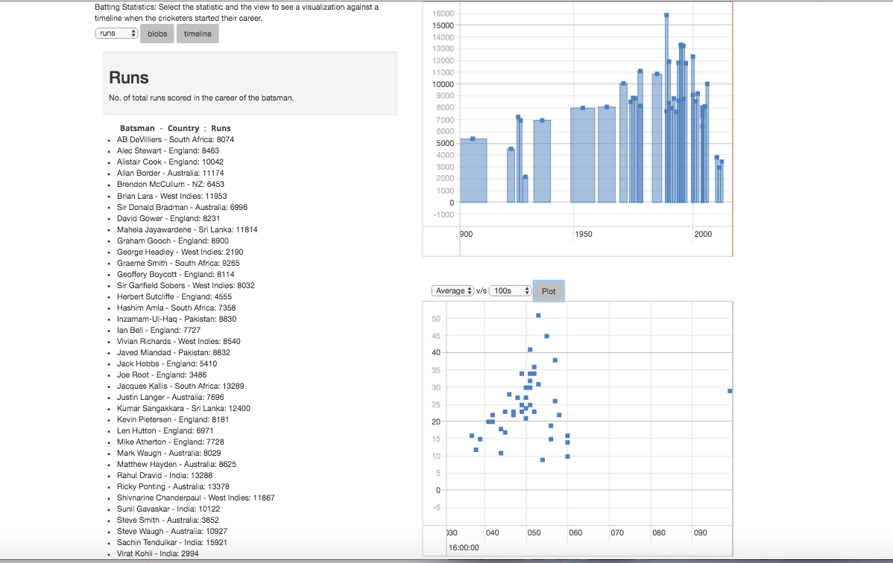

# Batting_Stats
Visualization of batting statistics of test cricketers. 

The application helps visualize the batting statistics of some of the
most famous test cricketers in the world . The statistics include Runs scored, the span of the career, Innings played, Not Outs, No. of centuries / half-centuries scored, Man of the Match awards earned.  The application gives a 
timeline, blob plot of the statistics.One can also compare different
statistics vs each other.

## Screenshot

#### Homepage 

#### A timeline view of the runs scored 
 

#### Extra plot to compare a statistic with the other with a scatter plot 
 

 
 
 

_The data is taken from EspnCricinfo Statsguru_.

